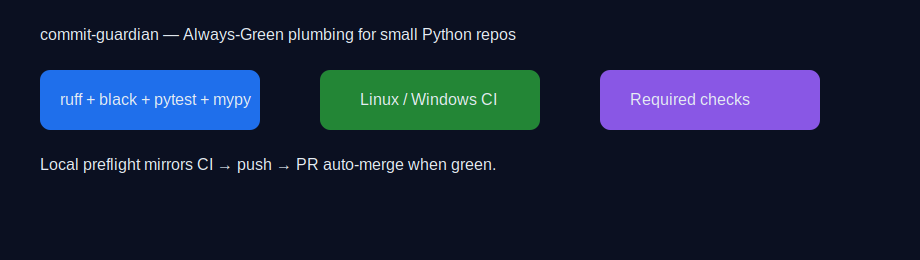

# commit-guardian

Tiny, fast starter for **Always‑Green** Python repositories: a clean package skeleton with
local gates (**ruff, black, pytest, mypy**) and GitHub Actions (**Linux + optional Windows**) wired
as required checks, plus CodeQL. It keeps your default branch green and your PRs friction‑free.

[](https://github.com/CoderDeltaLAN/commit-guardian/actions/workflows/ci.yml)
[](https://github.com/CoderDeltaLAN/commit-guardian/actions/workflows/codeql.yml)
[](LICENSE)
[](https://www.paypal.com/donate/?hosted_button_id=YVENCBNCZWVPW)

---



## Why

Green builds are non‑negotiable. This repo shows a compact, reproducible setup that
mirrors CI locally and gates PRs with the exact same checks. You get reliable signals,
clean history, and painless reviews.

## What It Includes

- **Package skeleton** under `src/commit_guardian`, versioned and importable.
- **Static quality gates**: `ruff`, `black`, `pytest`, and `mypy`.
- **GitHub Actions CI**: Linux matrix (3.11, 3.12) and **optional** Windows job.
- **CodeQL security** analysis.
- **Branch protection friendly** job names designed for required checks.

## How It Works

1. Run the local gate before pushing (same tools and configuration as CI).
2. Open a pull request; CI and CodeQL run automatically.
3. With required checks enabled, the PR can **auto‑merge** when everything is green.

## Installation (from source)

```bash
# inside project root
pip install .
# or with Poetry
poetry build && pip install dist/*.whl
```

> The package exports a minimal API you can import to verify installation.

## Quick Start

```bash
# lint + format checks
poetry run ruff check .
poetry run black --check .

# run tests and types
PYTHONPATH=src poetry run pytest -q
poetry run mypy .
```

Python import sanity:

```bash
python - <<'PY'
import importlib; m = importlib.import_module("commit_guardian")
print("import OK:", getattr(m, "__version__", "unknown"))
PY
```

## Local Developer Workflow

1. Create a branch.
2. Run the **local gate** (commands above). Fix until green.
3. Push and open a PR. Enable auto‑merge if your repository policy allows.
4. Keep commits **small and atomic**; use **Conventional Commits** for clarity.

## CLI / API

This template ships a tiny module and CLI entry point stub. Typical usage is
to import in tests or expand with your own commands.

```python
from commit_guardian import __version__, ping
assert callable(ping)
```

```bash
# if you add a console_script entry point, expose CLI here
# commit-guardian --help
```

## CI (GitHub Actions)

- Linux matrix on Python **3.11** and **3.12**.
- Windows job marked **optional** to avoid blocking merges on OS‑specific glitches.
- All CI steps mirror the local gate to prevent “works‑on‑my‑machine” surprises.

Snippet used in CI:

```yaml
- run: python -m pip install -U pip
- run: pip install ruff black pytest mypy
- run: ruff check .
- run: black --check .
- run: pytest -q
- run: mypy .
```

## Project Status & Roadmap

- ✅ Clean packaging and import sanity.
- ✅ Always‑Green CI with required checks and CodeQL.
- 🚧 Extend CLI, add real commands and richer examples.
- 🚧 Optional job fan‑out (e.g., wheels, coverage upload).

## Security

If you discover a security issue, please report it privately. Avoid filing public issues
with sensitive details. A basic CodeQL workflow is already enabled.

## Contributing

Use **Poetry** locally and keep PRs small:
```bash
poetry install --no-interaction
poetry run ruff check . --fix
poetry run ruff format .
poetry run black .
PYTHONPATH=src poetry run pytest -q
poetry run mypy .
```

---

## 🔍 SEO Keywords

always green ci, python package template, ruff black pytest mypy, github actions python,
code quality automation, codeql security scan, branch protection, required status checks,
clean code workflow, python project skeleton

## 💚 Donations & Sponsorship

Open‑source takes time. If this template saves you hours, consider supporting continued
maintenance and polish. Thank you!  
[](https://www.paypal.com/donate/?hosted_button_id=YVENCBNCZWVPW)

## 👤 Author

**CoderDeltaLAN (Yosvel)**  
Email: `coderdeltalan.cargo784@8alias.com`  
GitHub: https://github.com/CoderDeltaLAN

## 📄 License

Released under the **MIT License**. See the bundled `LICENSE` file for details.
